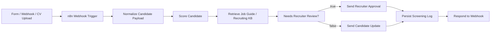
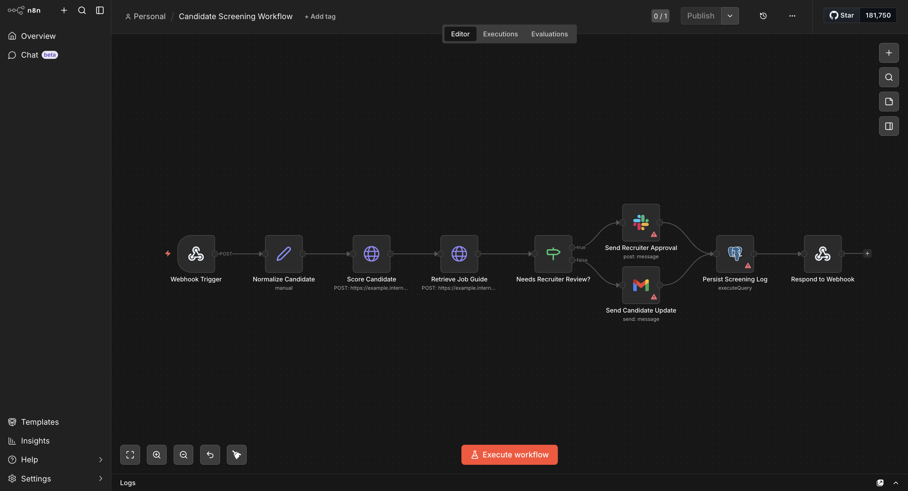

# Candidate Screening Workflow with n8n

`Candidate Screening Workflow with n8n` is a technical MVP for AI-assisted candidate intake, job matching, recruiter approval, and audit logging. The repository combines a native `n8n` workflow export with a reproducible Python baseline and a `Streamlit` inspection layer so the screening logic can be evaluated outside the automation editor.

## Problem Statement

Recruiting teams often receive heterogeneous candidate payloads from forms, email, ATS webhooks, and resume uploads. Before a recruiter spends time on a profile, the pipeline typically needs to:

- normalize candidate data;
- compare resume context against job requirements;
- decide whether the profile should advance, be reviewed, or be rejected;
- enforce `human-in-the-loop` controls for ambiguous or high-potential cases;
- persist the final state for auditability and downstream recruiting operations.

This project models that decision pipeline end-to-end.

## Solution Scope

This MVP focuses on the `screening orchestration layer`, not on claiming a fully productionized ATS. The repository is structured to demonstrate:

- canonical intake normalization for heterogeneous candidate payloads;
- model-assisted triage with explicit routing states;
- `human-in-the-loop` control points for recruiter override;
- event persistence for traceability and downstream analytics;
- a separation between orchestration, scoring, and inspection concerns.

## System Architecture



## Repository Deliverables

- native `n8n` workflow export in [workflows/candidate_screening_n8n.json](workflows/candidate_screening_n8n.json)
- demo job catalog in [data/raw/jobs.csv](data/raw/jobs.csv)
- demo candidate dataset in [data/raw/candidates.csv](data/raw/candidates.csv)
- reproducible screening baseline in [src/pipeline.py](src/pipeline.py)
- technical inspection UI in [app.py](app.py)
- automated validation in [tests/test_pipeline.py](tests/test_pipeline.py)

## Execution Model

The project is intentionally split into two execution surfaces:

### 1. Native n8n workflow

The `n8n` workflow acts as the orchestration layer and is responsible for:

- ingress through `Webhook Trigger`;
- canonical field preparation;
- external service invocation;
- conditional branching;
- recruiter notification;
- candidate notification;
- operational persistence;
- synchronous webhook response.

### 2. Python baseline

The Python layer acts as a deterministic reference implementation for:

- synthetic dataset generation;
- feature engineering;
- decision classification;
- artifact generation;
- technical inspection through `Streamlit`.

This split makes the repository easier to evaluate technically because the orchestration logic and the analytical logic can be inspected independently.

## Technical Stack

### Orchestration and integration

- `n8n`
- `Webhook`
- `Set`
- `HTTP Request`
- `IF`
- `Slack`
- `Gmail`
- `Postgres`
- `Respond to Webhook`

### Analytical layer

- `pandas` for tabular feature preparation and artifact persistence
- `scikit-learn` for feature vectorization and decision classification
- `TF-IDF` for sparse lexical-semantic encoding of resume and job context
- `Logistic Regression` for multi-class decisioning

### Inspection and observability

- `Streamlit` for technical walkthrough and reviewer-facing inspection
- `Plotly` for decision distribution visualization

## Integration Contract

The workflow is designed as if it were sitting between an upstream application source and downstream recruiting systems.

### Inbound payload contract

The webhook-facing contract assumes candidate events can provide fields such as:

- `candidate_id`
- `name`
- `email`
- `resume_summary`
- `skills`
- `years_experience`
- `current_location`
- `target_job_id`

### Outbound response contract

The `Respond to Webhook` node returns a normalized JSON object that can be consumed by:

- an ATS adapter;
- a recruiting portal;
- an internal API gateway;
- observability middleware.

The response body includes:

- `candidate_id`
- `target_job_id`
- `predicted_decision`
- `advance_probability`
- `requires_human_review`
- `recommended_next_step`

## Data Model

### Job schema

Each job record includes:

- `job_id`
- `title`
- `seniority`
- `location`
- `required_skills`
- `preferred_skills`
- `description`

### Candidate schema

Each candidate record includes:

- `candidate_id`
- `name`
- `source`
- `years_experience`
- `current_location`
- `resume_summary`
- `skills`
- `target_job_id`
- `ground_truth_decision`

### Derived screening features

The baseline enriches each candidate with:

- `required_match_ratio`
- `preferred_match_ratio`
- `location_match`
- `matched_job_title`
- `advance_probability`
- `review_probability`
- `predicted_decision`
- `recommended_next_step`
- `requires_human_review`
- `candidate_summary`

## Persistence Layer

The workflow models an operational sink in `Postgres` through the `Persist Screening Log` node. In production terms, this node behaves as a lightweight `screening event store`.

The persisted tuple currently includes:

- `candidate_id`
- `target_job_id`
- `predicted_decision`
- `advance_probability`
- `requires_human_review`

This persistence pattern is useful for:

- auditability;
- recruiter analytics;
- threshold tuning;
- downstream SLA monitoring;
- supervised feedback collection.

## Decisioning Logic

### 1. Feature engineering

The workflow derives structured signals from skill overlap and mobility constraints:

- `required_match_ratio`
  Hard-skill coverage against mandatory job requirements.
- `preferred_match_ratio`
  Additional coverage against non-mandatory but desirable skills.
- `location_match`
  Binary compatibility signal between candidate location and job location mode.
- `years_experience`
  Scalar operational context for ranking and recruiter interpretation.

### 2. Text representation

The pipeline builds a combined text representation for each candidate:

```text
resume_summary + skills + target job title + required skills + preferred skills
```

This representation is encoded with `TfidfVectorizer(ngram_range=(1, 2))`, allowing the model to capture unigrams and bigrams from both resume semantics and job context.

From an information retrieval perspective, this is a sparse lexical baseline that approximates candidate-to-role semantic alignment without introducing embedding infrastructure.

### 3. Multi-class screening model

`LogisticRegression(class_weight="balanced", max_iter=2000)` is trained to predict:

- `advance`
- `review`
- `reject`

The classifier is intentionally lightweight so the repository demonstrates the control-plane design of the workflow rather than claiming production-grade model performance.

Even so, the choice is technically reasonable for an MVP because:

- it is fast to train and interpret;
- it supports probabilistic output;
- it works well with sparse `TF-IDF` vectors;
- it creates a clean stepping stone toward later model-serving endpoints.

### 4. Human-in-the-loop routing

The baseline routes both `advance` and `review` outcomes into the recruiter approval queue:

- `advance`
  High-potential candidates still require recruiter confirmation before progressing.
- `review`
  Ambiguous profiles require manual inspection.
- `reject`
  Rejection is automatically templated and logged in the MVP.

This decision boundary is encoded through `requires_human_review`.

Operationally, this means the workflow is optimized for `high-recall recruiter review` rather than aggressive automation. That is a safer default in recruiting contexts, where false negatives are usually more expensive than false positives in the early funnel.

## n8n Workflow Semantics

The exported workflow is designed as an event-driven screening orchestration:

1. `Webhook Trigger`
   Receives a candidate application payload.
2. `Normalize Candidate`
   Creates a canonical screening payload.
3. `Score Candidate`
   Calls a model-serving or screening endpoint.
4. `Retrieve Job Guide`
   Enriches the decision with a role-specific recruiting guide or knowledge base.
5. `Needs Recruiter Review?`
   Applies routing logic to determine whether manual approval is required.
6. `Send Recruiter Approval`
   Notifies the recruiting team for a HITL decision.
7. `Send Candidate Update`
   Sends a system response for non-blocked flows.
8. `Persist Screening Log`
   Stores the screening event in an operational log table.
9. `Respond to Webhook`
   Returns a structured API response to the caller.

## Node-Level Technical Interpretation

### `Webhook Trigger`

Acts as the ingestion boundary and models an event-driven recruiting interface.

### `Normalize Candidate`

Represents payload canonicalization. In a production workflow, this is where schema harmonization, null-handling, and field coercion would happen.

### `Score Candidate`

Abstracts the model-serving boundary. In production, this node would typically call a `FastAPI`, serverless, or internal inference endpoint.

### `Retrieve Job Guide`

Represents retrieval augmentation for recruiter-specific context, such as role guides, interview rubrics, or hiring policies.

### `Needs Recruiter Review?`

Implements the primary decision gate. This is the explicit `HITL` control node of the workflow.

### `Send Recruiter Approval`

Models escalation to a human approver via collaboration tooling such as Slack or Teams.

### `Send Candidate Update`

Represents the automated communication branch of the workflow.

### `Persist Screening Log`

Acts as the operational write path for observability and downstream analytics.

### `Respond to Webhook`

Closes the synchronous request lifecycle with a normalized API response.

## Native n8n Interface

The workflow can also be inspected directly in the native `n8n` editor, which makes the orchestration logic, routing branches, and integration nodes easier to audit visually.



## Current Demo Results

Current output from [main.py](main.py):

```text
Candidate Screening Workflow with n8n
--------------------------------------------
candidates_processed: 6
decision_accuracy: 1.0
decision_macro_f1: 1.0
advance_recommended: 3
manual_review_queue: 5
```

### Correct interpretation

- the metrics come from a `demo controlled dataset`;
- the current dataset is small and intentionally curated;
- the goal is to validate workflow semantics, decision routing, and HITL integration;
- the results should not be interpreted as production benchmark quality.

## Evaluation Notes

The current evaluation is intentionally lightweight. The repository validates that:

- the feature engineering pipeline is stable;
- the classifier produces deterministic routing outputs;
- the recruiter-review queue is populated according to policy;
- the processed artifacts are persisted correctly.

For a production version, the evaluation stack should expand to include:

- `train / validation / test` segregation;
- calibration analysis for screening probabilities;
- `precision@k` for shortlist quality;
- false-negative analysis for rejected candidates;
- fairness diagnostics across protected or proxy attributes;
- recruiter override agreement metrics.

## Streamlit Interface

The `Streamlit` layer exposes four technical views:

### `Pipeline de screening`

- candidate-level screening output
- per-candidate summary
- operational feature vector for manual inspection

### `Vagas`

- registered job catalog
- predicted decision distribution
- explanation of how hard constraints and preferred signals are used

### `Aprovação humana`

- recruiter review queue
- HITL control rationale
- expected downstream recruiter actions

### `Métricas`

- baseline metrics table
- technical note on evaluation scope
- production evaluation recommendations

## Operational Considerations

From an engineering perspective, the next production-hardening steps would likely include:

- idempotency keys for webhook ingestion;
- retry policies for Slack, Gmail, and persistence connectors;
- dead-letter handling for failed notifications;
- structured logs and correlation IDs;
- versioned model endpoints;
- schema validation at ingress;
- PII handling, redaction, and access control;
- ATS synchronization and state reconciliation.

## Repository Structure

```text
candidate-screening-workflow-n8n/
├── app.py
├── main.py
├── requirements.txt
├── src/
│   ├── __init__.py
│   ├── pipeline.py
│   └── sample_data.py
├── tests/
│   └── test_pipeline.py
├── data/
│   ├── raw/
│   └── processed/
└── workflows/
    └── candidate_screening_n8n.json
```

## Local Execution

```bash
python3 -m venv .venv
source .venv/bin/activate
pip install -r requirements.txt
python3 main.py
streamlit run app.py
```

## Importing Into n8n

1. Open the local or hosted `n8n` editor.
2. Import [workflows/candidate_screening_n8n.json](workflows/candidate_screening_n8n.json).
3. Configure credentials for:
   - `HTTP Request`
   - `Slack`
   - `Gmail`
   - `Postgres`
4. Replace placeholder endpoints with:
   - a candidate scoring service
   - a recruiting knowledge base service
5. Map the `Respond to Webhook` output to the contract expected by the calling system.

## Production Evolution Path

Recommended next steps for a more realistic recruiting platform:

- resume parsing from PDF or DOCX
- skill ontology normalization
- embedding-based semantic job matching
- ATS integration
- recruiter feedback capture for supervised re-training
- calibration and threshold tuning for `advance` routing
- fairness and bias monitoring
- model serving behind `FastAPI` or equivalent

## Technical Positioning

This repository should be read as a `workflow-centric recruiting automation MVP` that demonstrates:

- event-driven orchestration in `n8n`;
- deterministic analytical baselines in Python;
- explicit human approval checkpoints;
- a clean handoff pattern between low-code automation and ML-assisted decisioning.

## Why This Project Is Useful In A Portfolio

This repository shows practical experience with:

- `n8n` workflow design
- human-in-the-loop control points
- model-assisted operational routing
- event-driven automation
- structured logging
- lightweight ML baselines supporting business process automation
